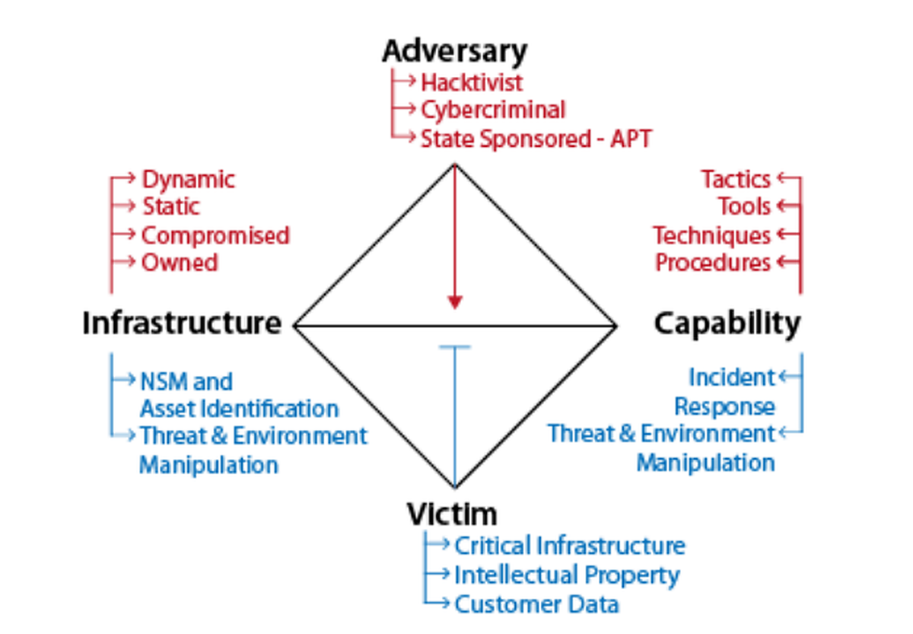
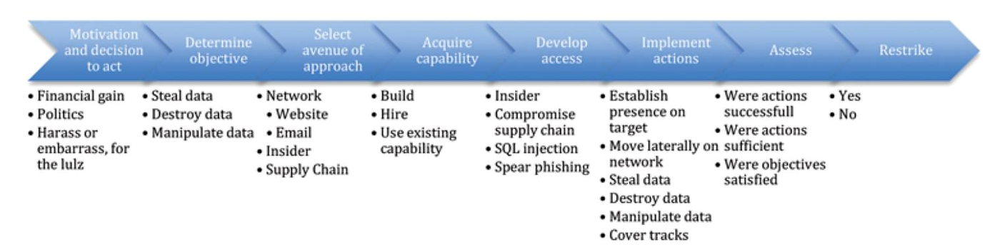
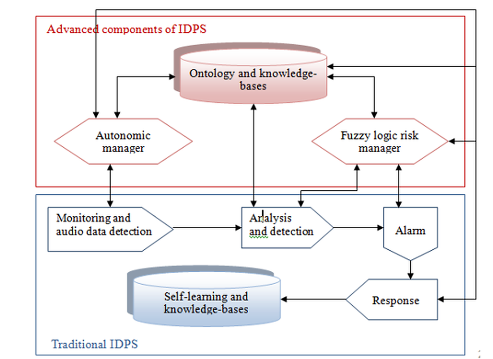

# Cyber Intelligence and Active Cyber Defence

This project investigates how cyber intelligence can be used to understand attacks, identify adversary behaviour and support faster defensive decisions. The work focuses on turning raw network and threat data into useful intelligence and connecting that information to practical defence actions.

The project covers the intelligence cycle, the Diamond Model, Active Cyber Defence, the cyber kill chain, strategic/operational/tactical levels of cyber intelligence, intrusion detection systems and AI-based methods for cyber defence.

A central part of the work is the development of an integrated conceptual model that connects the attacker-focused view of the Diamond Model with the defender-focused Active Cyber Defence cycle. This makes it possible to study adversary infrastructure, capabilities and objectives together with asset monitoring, incident response and changes to the network environment.

## Main topics

- Cyber-intelligence collection, processing, analysis and dissemination
- Diamond Model for intrusion analysis
- Active Cyber Defence and threat/environment manipulation
- Integration of attacker and defender viewpoints
- Cyber kill chain and proactive/reactive defence methods
- Strategic, operational and tactical cyber-intelligence levels
- Intrusion Detection and Prevention Systems (IDPS)
- Neural networks, intelligent agents, genetic algorithms and fuzzy systems for cyber defence

## Integrated cyber-intelligence model

The project combines two complementary views of a cyber attack. The upper part of the model focuses on the adversary, including infrastructure, capabilities, tactics and motivation. The lower part focuses on the defender, including asset identification, network security monitoring, incident response and threat/environment manipulation.

## Attack and defence analysis

The attack process was studied as a sequence of stages, from motivation and target selection to capability development, access, execution and reassessment. Defensive actions were then mapped to different attack phases using detection, denial, disruption, degradation and deception methods.

## AI for cyber defence

The project also examines how artificial intelligence can support intrusion detection and cybercrime defence. The methods include neural networks for anomaly detection, intelligent agents for distributed response, genetic algorithms for learning detection rules and fuzzy systems for handling uncertain behaviour.

## Report

The full English technical report is available in:

`docs/Cyber_Intelligence_Research_Report_English.docx`

